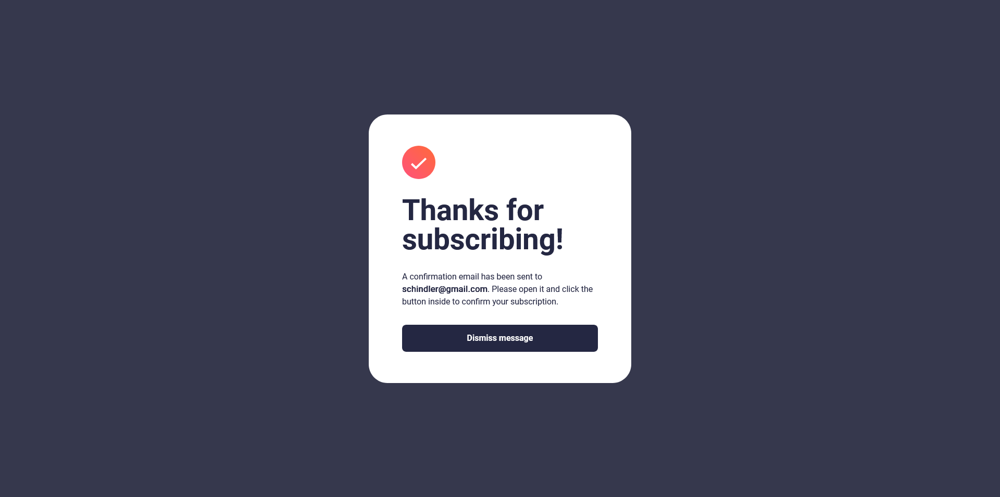

# Frontend Mentor - Newsletter sign-up form with success message solution

This is a solution to the [Newsletter sign-up form with success message challenge on Frontend Mentor](https://www.frontendmentor.io/challenges/newsletter-signup-form-with-success-message-3FC1AZbNrv). Frontend Mentor challenges help you improve your coding skills by building realistic projects. 

## Table of contents

- [Overview](#overview)
  - [The challenge](#the-challenge)
  - [Screenshot](#screenshot)
  - [Links](#links)
- [My process](#my-process)
  - [Built with](#built-with)
  - [What I learned](#what-i-learned)
  - [Continued development](#continued-development)
  - [Useful resources](#useful-resources)
- [Author](#author)

## Overview

  This project contains a form element with a separate success message upon successfuly submission of email. By building this project, I learned the basics of form handling and validation. I was able to handle the form errors on input change as well as on submission when incorrect email is placed in the input field. Additionally, I was able to practice my JavaScript fundamentals and make use of some event handlers and APIs that are available to me.

### The challenge

Users should be able to:

- Add their email and submit the form
- See a success message with their email after successfully submitting the form
- See form validation messages if:
  - The field is left empty
  - The email address is not formatted correctly
- View the optimal layout for the interface depending on their device's screen size
- See hover and focus states for all interactive elements on the page

### Screenshot

Initial:


Error:


Success:


### Links

- Solution URL: [https://www.frontendmentor.io/solutions/responsive-sign-up-form-with-client-side-form-validation-fHEKvrBGRx](https://www.frontendmentor.io/solutions/responsive-sign-up-form-with-client-side-form-validation-fHEKvrBGRx)
- Live Site URL: [https://schindlerdumagat.github.io/newsletter-sign-up-form/](https://schindlerdumagat.github.io/newsletter-sign-up-form/)

## My process

  This I was not confident with form handling and validation, I read some articles about it first before diving into the project.

### Built with

- Semantic HTML5 markup
- Flexbox
- CSS Grid
- Mobile-first workflow
- [Sass](https://sass-lang.com/) - CSS Preprocessor
- [BEM](https://getbem.com/) - Block Element Modifier

### What I learned

By building this project, I was able to gain the basics of form handling and validation. I was able to use some of the APIs available on the inputs elements in checking if the value in the input field is valid or not. If invalid, create function that will check what error occurred and provide the appropriate message in the user interface.

```js
function showError() {

    if (emailInput.validity.valueMissing) {
        inputError.textContent = "Email is required";
    } else  if (emailInput.validity.typeMismatch) {
        inputError.textContent = "Valid email required"
    }

    emailInput.classList.add("card__input--error");

}
```

### Continued development

I will learn more about the APIs JavaScript provides for manipulating the DOM and doing some logic while building more projects with increasing complexity. I believe spending time learning JavaScript will help me in the future when I am already using third party libraries such as React.

### Useful resources

- [MDN - Client-side form validation](https://developer.mozilla.org/en-US/docs/Learn_web_development/Extensions/Forms/Form_validation#validating_forms_using_javascript) - This gave me some of the approaches I can use when handling forms and doing validations.

## Author

- Website - [Schindler Dumagat](https://schindlerdumagat.github.io/webportfolio/)
- Frontend Mentor - [@schindlerdumagat](https://www.frontendmentor.io/profile/schindlerdumagat)
- LinkedIn - [Schindler - LinkedIn](https://www.linkedin.com/in/schindler-dumagat-015238230/)
